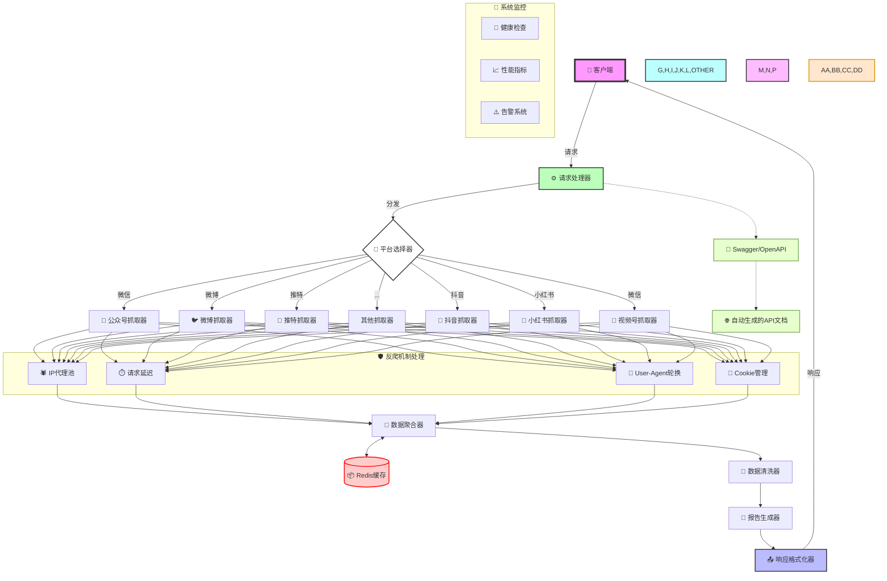
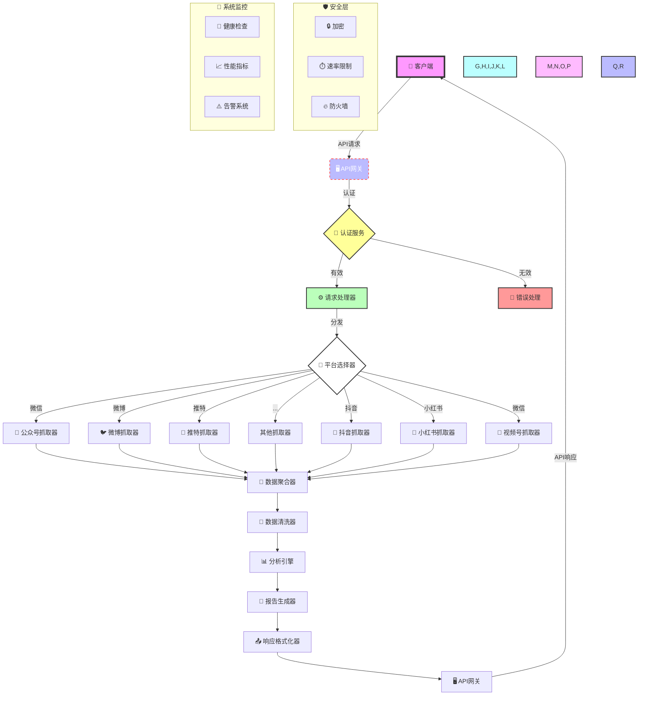

### 项目目录

```
huanqiu-summary-fetch/
│
├── src/
│   ├── index.js       // 入口文件
│   ├── routes/
│   │   ├── command.js // 处理指令的路由
│   ├── handlers/
│   │   ├── wechatHandler.js
│   │   ├── weiboHandler.js
│   │   ├── twitterHandler.js
│   │   ├── douyinHandler.js
│   │   ├── xiaohongshuHandler.js
│   │   └── videoHandler.js
│   ├── middleware/
│   │   ├── auth.js    // 认证中间件
│   │   └── errorHandler.js // 错误处理中间件
│   ├── services/
│   │   ├── authService.js // 认证服务
│   │   └── dataService.js // 数据处理服务
│   └── utils/
│       ├── apiHandler.js  // API处理工具
│       ├── logger.js // 记录日志工具
│       └── platformSelector.js // 平台选择器
│
├── package.json
└── README.md
```