```mermaid
flowchart TD
    A[🧑 客户端] -->|发送请求| B[📟 指令对象]
    B --> C{🔀 解析指令}
    
    subgraph "🛠️ 功能单元"
        D[🔍 搜索]
        E[👤 个人信息]
        E1[...其它功能]
    end
    
    subgraph "🌐 平台适配器"
        F[💬 微信公众号]
        G[🎥 视频号]
        H[🐦 微博]
        I[📕 小红书]
        J[🐤 推特]
        K[🎵 抖音]
    end
    
    C --> D & E & E1
    D & E & E1 --> F & G & H & I & J & K
    
    subgraph "🔐 登录状态"
        L[🔒 登录态]
        M[🔓 非登录态]
    end
    
    F & G & H & I & J & K --> L & M
    
    L & M --> N[🛡️ 反爬处理]
    N --> O[💾 数据聚合器]
    O <--> P[(📦 Redis缓存)]
    O --> Q[🔧 数据处理器]
    Q --> R[📤 响应格式化器]
    R -->|统一格式响应| A
    
    subgraph "📡 系统监控"
        S[💓 健康检查]
        T[📈 性能指标]
        U[⚠️ 告警系统]
    end
    
    style A fill:#f9f,stroke:#333,stroke-width:4px
    style B fill:#bfb,stroke:#333,stroke-width:2px
    style C fill:#fff,stroke:#333,stroke-width:2px
    style D,E fill:#e6ffcc,stroke:#82b366,stroke-width:2px
    style F,G,H,I,J,K fill:#bff,stroke:#333,stroke-width:2px
    style L,M fill:#ffe6cc,stroke:#d79b00,stroke-width:2px
    style N fill:#ff9999,stroke:#b85450,stroke-width:2px
    style O,Q fill:#fbf,stroke:#333,stroke-width:2px
    style P fill:#ffcccc,stroke:#ff0000,stroke-width:2px
    style R fill:#bbf,stroke:#333,stroke-width:2px
```

### 项目目录

```
huanqiu-summary-fetch/
│
├── src/
│   ├── index.js       // 入口文件
│   ├── routes/
│   │   ├── command.js // 处理指令的路由
│   ├── handlers/
│   │   ├── wechatHandler.js
│   │   ├── weiboHandler.js
│   │   ├── twitterHandler.js
│   │   ├── douyinHandler.js
│   │   ├── xiaohongshuHandler.js
│   │   └── videoHandler.js
│   ├── middleware/
│   │   ├── auth.js    // 认证中间件
│   │   └── errorHandler.js // 错误处理中间件
│   ├── services/
│   │   ├── authService.js // 认证服务
│   │   └── dataService.js // 数据处理服务
│   └── utils/
│       ├── apiHandler.js  // API处理工具
│       ├── logger.js // 记录日志工具
│       └── platformSelector.js // 平台选择器
│
├── package.json
└── README.md
```